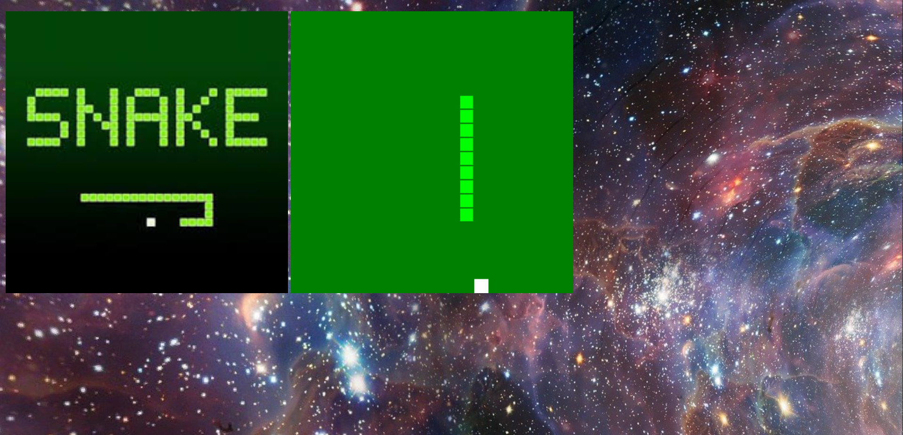

## The-greedy-snake-fights
:snake:2D canvas game based on the SnackGame,which is famous for past.

In this game, you can control the snake to eat like you control yourself.

Be careful！

Though the snake will not die,if its head touches its body, or if it eats its own body, it will start again in home!

The game goes like this:

If you are careful,you can see the green point,which is controlled by player.Above the game,a point-like is so-called "food",which would be possesed by you once touched by your snake.

## Snake
In real life,snakes don't hit a wall.

So your snake will not die,if it hits the wall,It will be back to square one.

Oh， I forgot to mention that snakes can't eat their own bodies, so the game is set to end if they touch their own bodies, Just like the lyrics of Teacher Liu Huan from Start all over again.

**If the heart in the dream is in, but is to start again**

So contorl your body careful!

## How to start

You can clone this repo,open it in vscode or other IDE, Just open index.

# Thanks

Uroborus:alien:

>The game is still under construction, waiting for your issues and pull requests.
 
>Feel free to fork,and pull requests!
